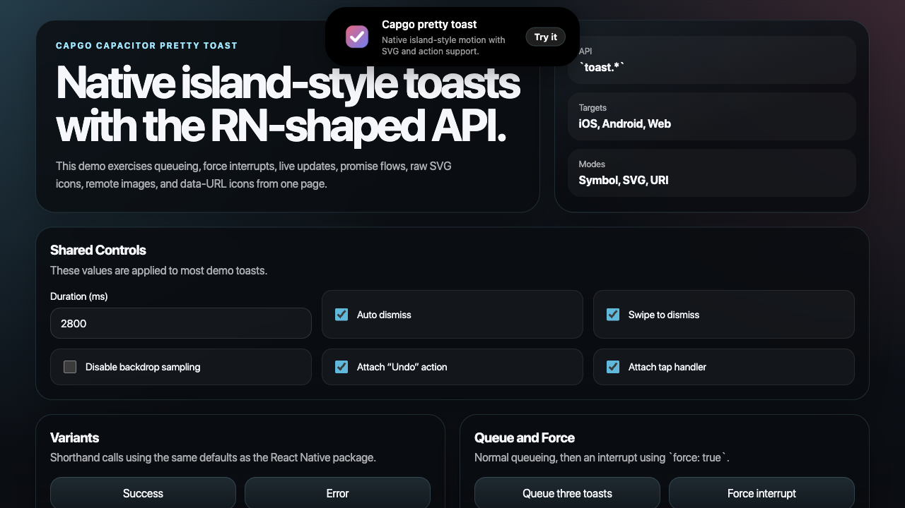

# @capgo/capacitor-pretty-toast

Native-first pretty toast notifications for Capacitor and the web.

[Promo video](./media/pretty-toast-demo.mp4)



This package keeps the familiar `toast.*` surface from `react-native-pretty-toast`, but ships as a Capacitor plugin with:

- native overlays on iOS and Android
- a DOM renderer on web
- queueing, `force`, `update`, `dismiss`, `dismissAll`, and `promise`
- symbol icons, raw SVG through `icon`, and URI-based images through `iconSource`

## Install

```bash
bun add @capgo/capacitor-pretty-toast
```

Then sync native platforms:

```bash
bunx cap sync
```

## Usage

```ts
import { toast } from '@capgo/capacitor-pretty-toast';

toast.success('Saved', {
  message: 'Your changes are already on disk.',
});

const id = toast.loading('Uploading', {
  message: 'This toast stays visible until you update it.',
});

setTimeout(() => {
  toast.update(id, {
    title: 'Upload complete',
    message: 'Updated in place without replaying the enter animation.',
    icon: 'checkmark.circle.fill',
    autoDismiss: true,
  });
}, 1500);
```

## API

The package exports:

- `toast.show(config, options?)`
- `toast.success(title, config?, options?)`
- `toast.error(title, config?, options?)`
- `toast.info(title, config?, options?)`
- `toast.warning(title, config?, options?)`
- `toast.loading(title, config?, options?)`
- `toast.update(id, partial)`
- `toast.promise(promise, messages)`
- `toast.dismiss(id?)`
- `toast.dismissAll()`

Important config fields:

- `icon`: symbol string or raw SVG markup
- `iconSource`: URI-like image input only (`https://`, `http://`, `file://`, `data:`, `blob:`, absolute file paths, or `{ uri }`)
- `title`
- `message`
- `duration`
- `autoDismiss`
- `enableSwipeDismiss`
- `accentColor`
- `strokeColor`
- `disableBackdropSampling`
- `action`
- `accessibilityAnnouncement`
- `onPress`
- `onShow`
- `onHide`
- `onAutoDismiss`

Notes:

- Raw SVG is accepted only through `icon`.
- `iconSource` always takes precedence over `icon`.
- `toast.loading()` defaults `autoDismiss` to `false`.

## Example App

The repo includes [`example-app/`](./example-app), a Vite-based Capacitor app with demos for:

- every `toast.*` method
- queueing and `force`
- live `update`
- `dismiss` and `dismissAll`
- `promise`
- symbol icons
- raw SVG icons
- remote and data-URL `iconSource` values
- repeatable capture modes with `?demo=hero`, `?demo=flow`, and `?demo=update`

`?demo=flow` is the promo enter/exit morph used in the README video.
The shipped video shows both the Android cutout path and the centered island-style path side by side.

Run it locally:

```bash
cd example-app
bun install
bun run start
```

## Development

```bash
bun install
bun run build
bun test
bun run verify
```
